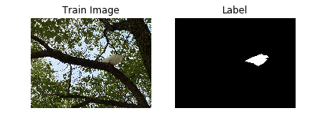
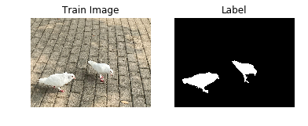
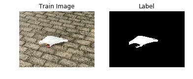
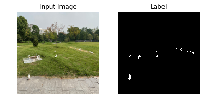

# aistudiotest
first time with aistudio
### U-Net网络图像的分割


### 一、项目背景介绍
简介：U-Net网络结构是一个基于FCN并改进后的深度学习网络，包含下采样（编码器，特征提取）和上采样（解码器，分辨率还原）两个阶段，因模型结构比较像U型而命名为U-Net。

#### 初始化环境


```python
import os
import io
import numpy as np
import matplotlib.pyplot as plt
from PIL import Image as PilImage

import paddle
from paddle.nn import functional as F

import warnings
warnings.filterwarnings('ignore') 

paddle.__version__
```


    '2.2.2'


### 二、数据介绍
本项目采用自建的鸽子图片数据集。
拍摄鸽子图片时尽量选择不同角度、不同背景进行拍摄，图片中的鸽子数量也尽量不同，以便增加图片的多样性从而提高最后模型的鲁棒性。由于本项目只是讲述流程，故这里仅采用了124张照片。
严格按照labelme github仓库主页的描述来安装labelme，链接为labelme github网址

#### 配置数据集


```python
#配置数据集
!unzip -q 'data/data75217/doves.zip' -d work/doves
```


```python
#查看数据集目录
#数据集解压后，里面放的每个文件夹中有四个文件，分别是图片文件、标签文件、标签名字文件和可视化的图片文件。
!tree /home/aistudio/work/doves
```


```python
#查看样本数量
images_path = "work/doves"
image_count = len([os.path.join(images_path, image_name) 
          for image_name in os.listdir(images_path)])
print("用于训练的图片样本数量:", image_count)
```

    用于训练的图片样本数量: 124


```python
#划分训练集
def _sort_images(image_dir):
    """
    对文件夹内的图像进行按照文件名排序
    """
    images = []
    labels = []

    for image_name in os.listdir(image_dir):
        if os.path.isdir(os.path.join(image_dir, image_name)):
            images.append(os.path.join(os.path.join(image_dir, image_name), 'img.png'))
            labels.append(os.path.join(os.path.join(image_dir, image_name), 'label.png'))

    return sorted(images), sorted(labels)

def write_file(mode, images, labels):
    with open('./{}.txt'.format(mode), 'w') as f:
        for i in range(len(images)):
            f.write('{}\t{}\n'.format(images[i], labels[i]))
```


```python
#对原始的数据集进行整理，得到数据集和标签两个数组，分别一一对应，这样可以在使用的时候能够很方便的找到原始数据和标签的对应关系。
images, labels = _sort_images(images_path)
eval_num = int(image_count * 0.15)
```


```python
#测试&验证数据集
write_file('train', images[:-eval_num], labels[:-eval_num])
write_file('test', images[-eval_num:], labels[-eval_num:])
write_file('eval', images[-eval_num:], labels[-eval_num:])
```

#### 数据集展示、测试
划分好数据集之后，来查验一下数据集是否符合预期，我们通过划分的配置文件读取图片路径后再加载图片数据来用matplotlib进行展示。


```python
with open('./train.txt', 'r') as f:
    i = 0

    for line in f.readlines():
        image_path, label_path = line.strip().split('\t')
        image = np.array(PilImage.open(image_path))
        label = np.array(PilImage.open(label_path))
    
        if i > 2:
            break
        # 进行图片的展示
        plt.figure()

        plt.subplot(1,2,1), 
        plt.title('Train Image')
        plt.imshow(image.astype('uint8'))
        plt.axis('off')

        plt.subplot(1,2,2), 
        plt.title('Label')
        plt.imshow(label.astype('uint8'), cmap='gray')
        plt.axis('off')

        plt.show()
        i = i + 1
```











#### 数据集类定义
// 飞桨（PaddlePaddle）数据集加载方案是统一使用Dataset（数据集定义） + DataLoader（多进程数据集加载）。
数据集定义主要是实现一个新的Dataset类，继承父类paddle.io.Dataset，并实现父类中以下两个抽象方法，__getitem__和__len__


```python
import random

from paddle.io import Dataset
from paddle.vision.transforms import transforms as T


class PetDataset(Dataset):
    """
    数据集定义
    """
    def __init__(self, mode='train'):
        """
        构造函数
        """
        self.image_size = IMAGE_SIZE
        self.mode = mode.lower()
        
        assert self.mode in ['train', 'test', 'predict'], \
            "mode should be 'train' or 'test' or 'predict', but got {}".format(self.mode)
        
        self.train_images = []
        self.label_images = []

        with open('./{}.txt'.format(self.mode), 'r') as f:
            for line in f.readlines():
                image, label = line.strip().split('\t')
                self.train_images.append(image)
                self.label_images.append(label)
        
    def _load_img(self, path, color_mode='rgb', transforms=[]):
        """
        统一的图像处理接口封装，用于规整图像大小和通道
        """
        with open(path, 'rb') as f:
            img = PilImage.open(io.BytesIO(f.read()))
            if color_mode == 'grayscale':
                # if image is not already an 8-bit, 16-bit or 32-bit grayscale image
                # convert it to an 8-bit grayscale image.
                if img.mode not in ('L', 'I;16', 'I'):
                    img = img.convert('L')
            elif color_mode == 'rgba':
                if img.mode != 'RGBA':
                    img = img.convert('RGBA')
            elif color_mode == 'rgb':
                if img.mode != 'RGB':
                    img = img.convert('RGB')
            else:
                raise ValueError('color_mode must be "grayscale", "rgb", or "rgba"')
            
            return T.Compose([
                T.Resize(self.image_size)
            ] + transforms)(img)

    def __getitem__(self, idx):
        """
        返回 image, label
        """
        train_image = self._load_img(self.train_images[idx], 
                                     transforms=[
                                         T.Transpose(), 
                                         T.Normalize(mean=127.5, std=127.5)
                                     ]) # 加载原始图像
        label_image = self._load_img(self.label_images[idx], 
                                     color_mode='grayscale',
                                     transforms=[T.Grayscale()]) # 加载Label图像
    
        # 返回image, label
        train_image = np.array(train_image, dtype='float32')
        label_image = np.array(label_image, dtype='int64')
        return train_image, label_image
        
    def __len__(self):
        """
        返回数据集总数
        """
        return len(self.train_images)
```

### 三、模型介绍、
U-Net是一个U型网络结构，可以看做两个大的阶段，图像先经过Encoder编码器进行下采样得到高级语义特征图，再经过Decoder解码器上采样将特征图恢复到原图片的分辨率。
具体的网络定义的代码可以参考code目录下的unet.py文件,具体网络结构包括如下几部分。

#### 模型组网
我们为了减少卷积操作中的训练参数来提升性能，是继承paddle.nn.Layer自定义了一个SeparableConv2D Layer类，
整个过程是把filter_size * filter_size * num_filters的Conv2D操作拆解为两个子Conv2D，先对输入数据的每个通道使用filter_size * filter_size * 1的卷积核进行计算，输入输出通道数目相同，之后在使用1 * 1 * num_filters的卷积核计算。


```python
from paddle.nn import functional as F

class SeparableConv2D(paddle.nn.Layer):
    def __init__(self, 
                 in_channels, 
                 out_channels, 
                 kernel_size, 
                 stride=1, 
                 padding=0, 
                 dilation=1, 
                 groups=None, 
                 weight_attr=None, 
                 bias_attr=None, 
                 data_format="NCHW"):
        super(SeparableConv2D, self).__init__()

        self._padding = padding
        self._stride = stride
        self._dilation = dilation
        self._in_channels = in_channels
        self._data_format = data_format

        # 第一次卷积参数，没有偏置参数
        filter_shape = [in_channels, 1] + self.convert_to_list(kernel_size, 2, 'kernel_size')
        self.weight_conv = self.create_parameter(shape=filter_shape, attr=weight_attr)

        # 第二次卷积参数
        filter_shape = [out_channels, in_channels] + self.convert_to_list(1, 2, 'kernel_size')
        self.weight_pointwise = self.create_parameter(shape=filter_shape, attr=weight_attr)
        self.bias_pointwise = self.create_parameter(shape=[out_channels], 
                                                    attr=bias_attr, 
                                                    is_bias=True)
    
    def convert_to_list(self, value, n, name, dtype=np.int):
        if isinstance(value, dtype):
            return [value, ] * n
        else:
            try:
                value_list = list(value)
            except TypeError:
                raise ValueError("The " + name +
                                "'s type must be list or tuple. Received: " + str(
                                    value))
            if len(value_list) != n:
                raise ValueError("The " + name + "'s length must be " + str(n) +
                                ". Received: " + str(value))
            for single_value in value_list:
                try:
                    dtype(single_value)
                except (ValueError, TypeError):
                    raise ValueError(
                        "The " + name + "'s type must be a list or tuple of " + str(
                            n) + " " + str(dtype) + " . Received: " + str(
                                value) + " "
                        "including element " + str(single_value) + " of type" + " "
                        + str(type(single_value)))
            return value_list
    
    def forward(self, inputs):
        conv_out = F.conv2d(inputs, 
                            self.weight_conv, 
                            padding=self._padding,
                            stride=self._stride,
                            dilation=self._dilation,
                            groups=self._in_channels,
                            data_format=self._data_format)
        
        out = F.conv2d(conv_out,
                       self.weight_pointwise,
                       bias=self.bias_pointwise,
                       padding=0,
                       stride=1,
                       dilation=1,
                       groups=1,
                       data_format=self._data_format)

        return out
```

#### 定义Encoder编码器
我们将网络结构中的Encoder下采样过程进行了一个Layer封装，方便后续调用，减少代码编写，下采样是有一个模型逐渐向下画曲线的一个过程，这个过程中是不断的重复一个单元结构将通道数不断增加，形状不断缩小，并且引入残差网络结构，我们将这些都抽象出来进行统一封装。


```python
class Encoder(paddle.nn.Layer):
    def __init__(self, in_channels, out_channels):
        super(Encoder, self).__init__()
        
        self.relus = paddle.nn.LayerList(
            [paddle.nn.ReLU() for i in range(2)])
        self.separable_conv_01 = SeparableConv2D(in_channels, 
                                                 out_channels, 
                                                 kernel_size=3, 
                                                 padding='same')
        self.bns = paddle.nn.LayerList(
            [paddle.nn.BatchNorm2D(out_channels) for i in range(2)])
        
        self.separable_conv_02 = SeparableConv2D(out_channels, 
                                                 out_channels, 
                                                 kernel_size=3, 
                                                 padding='same')
        self.pool = paddle.nn.MaxPool2D(kernel_size=3, stride=2, padding=1)
        self.residual_conv = paddle.nn.Conv2D(in_channels, 
                                              out_channels, 
                                              kernel_size=1, 
                                              stride=2, 
                                              padding='same')

    def forward(self, inputs):
        previous_block_activation = inputs
        
        y = self.relus[0](inputs)
        y = self.separable_conv_01(y)
        y = self.bns[0](y)
        y = self.relus[1](y)
        y = self.separable_conv_02(y)
        y = self.bns[1](y)
        y = self.pool(y)
        
        residual = self.residual_conv(previous_block_activation)
        y = paddle.add(y, residual)

        return y
```

#### 定义Decoder解码器
在通道数达到最大得到高级语义特征图后，网络结构会开始进行decode操作，进行上采样，通道数逐渐减小，对应图片尺寸逐步增加，
直至恢复到原图像大小，那么这个过程里面也是通过不断的重复相同结构的残差网络完成，我们也是为了减少代码编写，将这个过程定义一个Layer来放到模型组网中使用。


```python
class Decoder(paddle.nn.Layer):
    def __init__(self, in_channels, out_channels):
        super(Decoder, self).__init__()

        self.relus = paddle.nn.LayerList(
            [paddle.nn.ReLU() for i in range(2)])
        self.conv_transpose_01 = paddle.nn.Conv2DTranspose(in_channels, 
                                                           out_channels, 
                                                           kernel_size=3, 
                                                           padding=1)
        self.conv_transpose_02 = paddle.nn.Conv2DTranspose(out_channels, 
                                                           out_channels, 
                                                           kernel_size=3, 
                                                           padding=1)
        self.bns = paddle.nn.LayerList(
            [paddle.nn.BatchNorm2D(out_channels) for i in range(2)]
        )
        self.upsamples = paddle.nn.LayerList(
            [paddle.nn.Upsample(scale_factor=2.0) for i in range(2)]
        )
        self.residual_conv = paddle.nn.Conv2D(in_channels, 
                                              out_channels, 
                                              kernel_size=1, 
                                              padding='same')

    def forward(self, inputs):
        previous_block_activation = inputs

        y = self.relus[0](inputs)
        y = self.conv_transpose_01(y)
        y = self.bns[0](y)
        y = self.relus[1](y)
        y = self.conv_transpose_02(y)
        y = self.bns[1](y)
        y = self.upsamples[0](y)
        
        residual = self.upsamples[1](previous_block_activation)
        residual = self.residual_conv(residual)
        
        y = paddle.add(y, residual)
        
        return y
```

#### 训练模型组网
按照U型网络结构格式进行整体的网络结构搭建，三次下采样，四次上采样。


```python
class PetNet(paddle.nn.Layer):
    def __init__(self, num_classes):
        super(PetNet, self).__init__()

        self.conv_1 = paddle.nn.Conv2D(3, 32, 
                                       kernel_size=3,
                                       stride=2,
                                       padding='same')
        self.bn = paddle.nn.BatchNorm2D(32)
        self.relu = paddle.nn.ReLU()

        in_channels = 32
        self.encoders = []
        self.encoder_list = [64, 128, 256]
        self.decoder_list = [256, 128, 64, 32]

        # 根据下采样个数和配置循环定义子Layer，避免重复写一样的程序
        for out_channels in self.encoder_list:
            block = self.add_sublayer('encoder_{}'.format(out_channels),
                                      Encoder(in_channels, out_channels))
            self.encoders.append(block)
            in_channels = out_channels

        self.decoders = []

        # 根据上采样个数和配置循环定义子Layer，避免重复写一样的程序
        for out_channels in self.decoder_list:
            block = self.add_sublayer('decoder_{}'.format(out_channels), 
                                      Decoder(in_channels, out_channels))
            self.decoders.append(block)
            in_channels = out_channels

        self.output_conv = paddle.nn.Conv2D(in_channels, 
                                            num_classes, 
                                            kernel_size=3, 
                                            padding='same')
    
    def forward(self, inputs):
        y = self.conv_1(inputs)
        y = self.bn(y)
        y = self.relu(y)
        
        for encoder in self.encoders:
            y = encoder(y)

        for decoder in self.decoders:
            y = decoder(y)
        
        y = self.output_conv(y)
        
        return y
```

#### 基于PaddleSeg使用U-Net网络实现鸽子图像的语义分割


```python
!pip install paddleseg
```

    Looking in indexes: https://pypi.tuna.tsinghua.edu.cn/simple
    Collecting paddleseg
      Downloading https://pypi.tuna.tsinghua.edu.cn/packages/1b/5b/44c7fc5b5f030553ecf391bba0e484856f31860b24d7730d53c41aa2cc3d/paddleseg-2.4.0-py3-none-any.whl (275 kB)
         |████████████████████████████████| 275 kB 9.5 MB/s            
    [?25hRequirement already satisfied: flake8 in /opt/conda/envs/python35-paddle120-env/lib/python3.7/site-packages (from paddleseg) (4.0.1)
    Requirement already satisfied: scipy in /opt/conda/envs/python35-paddle120-env/lib/python3.7/site-packages (from paddleseg) (1.3.0)
    Requirement already satisfied: pre-commit in /opt/conda/envs/python35-paddle120-env/lib/python3.7/site-packages (from paddleseg) (1.21.0)
    Requirement already satisfied: pyyaml>=5.1 in /opt/conda/envs/python35-paddle120-env/lib/python3.7/site-packages (from paddleseg) (5.1.2)
    Requirement already satisfied: filelock in /opt/conda/envs/python35-paddle120-env/lib/python3.7/site-packages (from paddleseg) (3.0.12)
    Requirement already satisfied: opencv-python in /opt/conda/envs/python35-paddle120-env/lib/python3.7/site-packages (from paddleseg) (4.1.1.26)
    Requirement already satisfied: sklearn in /opt/conda/envs/python35-paddle120-env/lib/python3.7/site-packages (from paddleseg) (0.0)
    Requirement already satisfied: yapf==0.26.0 in /opt/conda/envs/python35-paddle120-env/lib/python3.7/site-packages (from paddleseg) (0.26.0)
    Requirement already satisfied: prettytable in /opt/conda/envs/python35-paddle120-env/lib/python3.7/site-packages (from paddleseg) (0.7.2)
    Requirement already satisfied: tqdm in /opt/conda/envs/python35-paddle120-env/lib/python3.7/site-packages (from paddleseg) (4.27.0)
    Requirement already satisfied: visualdl>=2.0.0 in /opt/conda/envs/python35-paddle120-env/lib/python3.7/site-packages (from paddleseg) (2.2.0)
    Requirement already satisfied: pandas in /opt/conda/envs/python35-paddle120-env/lib/python3.7/site-packages (from visualdl>=2.0.0->paddleseg) (1.1.5)
    Requirement already satisfied: numpy in /opt/conda/envs/python35-paddle120-env/lib/python3.7/site-packages (from visualdl>=2.0.0->paddleseg) (1.19.5)
    Requirement already satisfied: requests in /opt/conda/envs/python35-paddle120-env/lib/python3.7/site-packages (from visualdl>=2.0.0->paddleseg) (2.24.0)
    Requirement already satisfied: bce-python-sdk in /opt/conda/envs/python35-paddle120-env/lib/python3.7/site-packages (from visualdl>=2.0.0->paddleseg) (0.8.53)
    Requirement already satisfied: six>=1.14.0 in /opt/conda/envs/python35-paddle120-env/lib/python3.7/site-packages (from visualdl>=2.0.0->paddleseg) (1.16.0)
    Requirement already satisfied: flask>=1.1.1 in /opt/conda/envs/python35-paddle120-env/lib/python3.7/site-packages (from visualdl>=2.0.0->paddleseg) (1.1.1)
    Requirement already satisfied: Pillow>=7.0.0 in /opt/conda/envs/python35-paddle120-env/lib/python3.7/site-packages (from visualdl>=2.0.0->paddleseg) (8.2.0)
    Requirement already satisfied: Flask-Babel>=1.0.0 in /opt/conda/envs/python35-paddle120-env/lib/python3.7/site-packages (from visualdl>=2.0.0->paddleseg) (1.0.0)
    Requirement already satisfied: shellcheck-py in /opt/conda/envs/python35-paddle120-env/lib/python3.7/site-packages (from visualdl>=2.0.0->paddleseg) (0.7.1.1)
    Requirement already satisfied: matplotlib in /opt/conda/envs/python35-paddle120-env/lib/python3.7/site-packages (from visualdl>=2.0.0->paddleseg) (2.2.3)
    Requirement already satisfied: protobuf>=3.11.0 in /opt/conda/envs/python35-paddle120-env/lib/python3.7/site-packages (from visualdl>=2.0.0->paddleseg) (3.14.0)
    Requirement already satisfied: pyflakes<2.5.0,>=2.4.0 in /opt/conda/envs/python35-paddle120-env/lib/python3.7/site-packages (from flake8->paddleseg) (2.4.0)
    Requirement already satisfied: importlib-metadata<4.3 in /opt/conda/envs/python35-paddle120-env/lib/python3.7/site-packages (from flake8->paddleseg) (4.2.0)
    Requirement already satisfied: mccabe<0.7.0,>=0.6.0 in /opt/conda/envs/python35-paddle120-env/lib/python3.7/site-packages (from flake8->paddleseg) (0.6.1)
    Requirement already satisfied: pycodestyle<2.9.0,>=2.8.0 in /opt/conda/envs/python35-paddle120-env/lib/python3.7/site-packages (from flake8->paddleseg) (2.8.0)
    Requirement already satisfied: aspy.yaml in /opt/conda/envs/python35-paddle120-env/lib/python3.7/site-packages (from pre-commit->paddleseg) (1.3.0)
    Requirement already satisfied: virtualenv>=15.2 in /opt/conda/envs/python35-paddle120-env/lib/python3.7/site-packages (from pre-commit->paddleseg) (16.7.9)
    Requirement already satisfied: identify>=1.0.0 in /opt/conda/envs/python35-paddle120-env/lib/python3.7/site-packages (from pre-commit->paddleseg) (1.4.10)
    Requirement already satisfied: cfgv>=2.0.0 in /opt/conda/envs/python35-paddle120-env/lib/python3.7/site-packages (from pre-commit->paddleseg) (2.0.1)
    Requirement already satisfied: nodeenv>=0.11.1 in /opt/conda/envs/python35-paddle120-env/lib/python3.7/site-packages (from pre-commit->paddleseg) (1.3.4)
    Requirement already satisfied: toml in /opt/conda/envs/python35-paddle120-env/lib/python3.7/site-packages (from pre-commit->paddleseg) (0.10.0)
    Requirement already satisfied: scikit-learn in /opt/conda/envs/python35-paddle120-env/lib/python3.7/site-packages (from sklearn->paddleseg) (0.22.1)
    Requirement already satisfied: Jinja2>=2.10.1 in /opt/conda/envs/python35-paddle120-env/lib/python3.7/site-packages (from flask>=1.1.1->visualdl>=2.0.0->paddleseg) (2.11.0)
    Requirement already satisfied: click>=5.1 in /opt/conda/envs/python35-paddle120-env/lib/python3.7/site-packages (from flask>=1.1.1->visualdl>=2.0.0->paddleseg) (7.0)
    Requirement already satisfied: Werkzeug>=0.15 in /opt/conda/envs/python35-paddle120-env/lib/python3.7/site-packages (from flask>=1.1.1->visualdl>=2.0.0->paddleseg) (0.16.0)
    Requirement already satisfied: itsdangerous>=0.24 in /opt/conda/envs/python35-paddle120-env/lib/python3.7/site-packages (from flask>=1.1.1->visualdl>=2.0.0->paddleseg) (1.1.0)
    Requirement already satisfied: pytz in /opt/conda/envs/python35-paddle120-env/lib/python3.7/site-packages (from Flask-Babel>=1.0.0->visualdl>=2.0.0->paddleseg) (2019.3)
    Requirement already satisfied: Babel>=2.3 in /opt/conda/envs/python35-paddle120-env/lib/python3.7/site-packages (from Flask-Babel>=1.0.0->visualdl>=2.0.0->paddleseg) (2.8.0)
    Requirement already satisfied: zipp>=0.5 in /opt/conda/envs/python35-paddle120-env/lib/python3.7/site-packages (from importlib-metadata<4.3->flake8->paddleseg) (3.7.0)
    Requirement already satisfied: typing-extensions>=3.6.4 in /opt/conda/envs/python35-paddle120-env/lib/python3.7/site-packages (from importlib-metadata<4.3->flake8->paddleseg) (4.0.1)
    Requirement already satisfied: pycryptodome>=3.8.0 in /opt/conda/envs/python35-paddle120-env/lib/python3.7/site-packages (from bce-python-sdk->visualdl>=2.0.0->paddleseg) (3.9.9)
    Requirement already satisfied: future>=0.6.0 in /opt/conda/envs/python35-paddle120-env/lib/python3.7/site-packages (from bce-python-sdk->visualdl>=2.0.0->paddleseg) (0.18.0)
    Requirement already satisfied: cycler>=0.10 in /opt/conda/envs/python35-paddle120-env/lib/python3.7/site-packages (from matplotlib->visualdl>=2.0.0->paddleseg) (0.10.0)
    Requirement already satisfied: kiwisolver>=1.0.1 in /opt/conda/envs/python35-paddle120-env/lib/python3.7/site-packages (from matplotlib->visualdl>=2.0.0->paddleseg) (1.1.0)
    Requirement already satisfied: pyparsing!=2.0.4,!=2.1.2,!=2.1.6,>=2.0.1 in /opt/conda/envs/python35-paddle120-env/lib/python3.7/site-packages (from matplotlib->visualdl>=2.0.0->paddleseg) (3.0.7)
    Requirement already satisfied: python-dateutil>=2.1 in /opt/conda/envs/python35-paddle120-env/lib/python3.7/site-packages (from matplotlib->visualdl>=2.0.0->paddleseg) (2.8.2)
    Requirement already satisfied: urllib3!=1.25.0,!=1.25.1,<1.26,>=1.21.1 in /opt/conda/envs/python35-paddle120-env/lib/python3.7/site-packages (from requests->visualdl>=2.0.0->paddleseg) (1.25.6)
    Requirement already satisfied: idna<3,>=2.5 in /opt/conda/envs/python35-paddle120-env/lib/python3.7/site-packages (from requests->visualdl>=2.0.0->paddleseg) (2.8)
    Requirement already satisfied: certifi>=2017.4.17 in /opt/conda/envs/python35-paddle120-env/lib/python3.7/site-packages (from requests->visualdl>=2.0.0->paddleseg) (2019.9.11)
    Requirement already satisfied: chardet<4,>=3.0.2 in /opt/conda/envs/python35-paddle120-env/lib/python3.7/site-packages (from requests->visualdl>=2.0.0->paddleseg) (3.0.4)
    Requirement already satisfied: joblib>=0.11 in /opt/conda/envs/python35-paddle120-env/lib/python3.7/site-packages (from scikit-learn->sklearn->paddleseg) (0.14.1)
    Requirement already satisfied: MarkupSafe>=0.23 in /opt/conda/envs/python35-paddle120-env/lib/python3.7/site-packages (from Jinja2>=2.10.1->flask>=1.1.1->visualdl>=2.0.0->paddleseg) (2.0.1)
    Requirement already satisfied: setuptools in /opt/conda/envs/python35-paddle120-env/lib/python3.7/site-packages (from kiwisolver>=1.0.1->matplotlib->visualdl>=2.0.0->paddleseg) (41.4.0)
    Installing collected packages: paddleseg
    Successfully installed paddleseg-2.4.0
    WARNING: You are using pip version 21.3.1; however, version 22.0.3 is available.
    You should consider upgrading via the '/opt/conda/envs/python35-paddle120-env/bin/python -m pip install --upgrade pip' command.


```python
!git clone https://github.com/PaddlePaddle/PaddleSeg.git
```

    Cloning into 'PaddleSeg'...
    fatal: unable to access 'https://github.com/PaddlePaddle/PaddleSeg.git/': gnutls_handshake() failed: Error in the pull function.


```python
!unzip -q data/data75217/PaddleSeg.zip -d work
```

### 四、模型训练
使用模型代码进行Model实例生成，使用prepare接口定义优化器、损失函数和评价指标等信息，用于后续训练使用。在所有初步配置完成后，调用fit接口开启训练执行过程，调用fit时只需要将前面定义好的训练数据集、测试数据集、训练轮次（Epoch）和批次大小（batch_size）配置好即可。

#### 开始训练


```python
!python work/PaddleSeg/train.py --config unet.yml --save_interval 2000
```

    /opt/conda/envs/python35-paddle120-env/lib/python3.7/site-packages/setuptools/depends.py:2: DeprecationWarning: the imp module is deprecated in favour of importlib; see the module's documentation for alternative uses
      import imp
    /home/aistudio/work/PaddleSeg/paddleseg/cvlibs/param_init.py:89: DeprecationWarning: invalid escape sequence \s
      """
    /home/aistudio/work/PaddleSeg/paddleseg/models/losses/binary_cross_entropy_loss.py:82: DeprecationWarning: invalid escape sequence \|
      """
    /home/aistudio/work/PaddleSeg/paddleseg/models/losses/lovasz_loss.py:50: DeprecationWarning: invalid escape sequence \i
      """
    /home/aistudio/work/PaddleSeg/paddleseg/models/losses/lovasz_loss.py:77: DeprecationWarning: invalid escape sequence \i
      """
    /home/aistudio/work/PaddleSeg/paddleseg/models/losses/lovasz_loss.py:120: DeprecationWarning: invalid escape sequence \i
      """
    2022-02-20 23:57:11 [INFO]	
    ------------Environment Information-------------
    platform: Linux-4.4.0-166-generic-x86_64-with-debian-stretch-sid
    Python: 3.7.4 (default, Aug 13 2019, 20:35:49) [GCC 7.3.0]
    Paddle compiled with cuda: False
    GCC: gcc (Ubuntu 7.5.0-3ubuntu1~16.04) 7.5.0
    PaddlePaddle: 2.2.2
    OpenCV: 4.1.1
    ------------------------------------------------
    Traceback (most recent call last):
      File "work/PaddleSeg/train.py", line 154, in <module>
        main(args)
      File "work/PaddleSeg/train.py", line 115, in main
        batch_size=args.batch_size)
      File "/home/aistudio/work/PaddleSeg/paddleseg/cvlibs/config.py", line 76, in __init__
        raise FileNotFoundError('File {} does not exist'.format(path))
    FileNotFoundError: File unet.yml does not exist


```python
import paddle
from code.unet import DoveNet
from code.dove_dataset import DoveDataset


num_classes = 2
network = DoveNet(num_classes)

state_dict = paddle.load('unet.pdparams')
network.set_state_dict(state_dict)
model = paddle.Model(network)


predict_dataset = DoveDataset(mode='test')
test_loader = paddle.io.DataLoader(predict_dataset, places=paddle.CUDAPlace(0), batch_size= 32)
model.prepare(paddle.nn.CrossEntropyLoss(axis=1))
predict_results = model.predict(test_loader)
```


    ---------------------------------------------------------------------------

    ModuleNotFoundError                       Traceback (most recent call last)

    /tmp/ipykernel_129/952069278.py in <module>
          1 import paddle
    ----> 2 from code.unet import DoveNet
          3 from code.dove_dataset import DoveDataset
          4 
          5 


    ModuleNotFoundError: No module named 'code.unet'; 'code' is not a package


### 五、模型评估


```python

import numpy as np
import matplotlib.pyplot as plt
from paddle.vision.transforms import transforms as T
from PIL import Image as PilImage


```


```python
plt.figure(figsize=(10, 10))

IMAGE_SIZE = (224, 224)
i = 0
idx = 0

with open('./test.txt', 'r') as f:
    for line in f.readlines():
        image_path, label_path = line.strip().split('\t')
        resize_t = T.Compose([
            T.Resize(IMAGE_SIZE)
        ])
        image = resize_t(PilImage.open(image_path))
        label = resize_t(PilImage.open(label_path))

        image = np.array(image).astype('uint8')
        label = np.array(label).astype('uint8')

        if i > 8: 
            break
        plt.subplot(3, 3, i + 1)
        plt.imshow(image)
        plt.title('Input Image')
        plt.axis("off")

        plt.subplot(3, 3, i + 2)
        plt.imshow(label, cmap='gray')
        plt.title('Label')
        plt.axis("off")
        
        data = predict_results[0][0][idx].transpose((1, 2, 0))
        mask = np.argmax(data, axis=-1)

        plt.subplot(3, 3, i + 3)
        plt.imshow(mask.astype('uint8'), cmap='gray')
        plt.title('Predict')
        plt.axis("off")
        i += 3
        idx += 1

plt.show()
```


    ---------------------------------------------------------------------------

    NameError                                 Traceback (most recent call last)

    /tmp/ipykernel_129/1667864830.py in <module>
         29         plt.axis("off")
         30 
    ---> 31         data = predict_results[0][0][idx].transpose((1, 2, 0))
         32         mask = np.argmax(data, axis=-1)
         33 


    NameError: name 'predict_results' is not defined





### 六、总结与升华
本项目从零开始，全流程的尝试了基于Paddle的图像分割方法。
在自建分割数据集的基础上，分别使用Paddle2.0和PaddleSeg2.0介绍了基于U-Net的图像分割方法。
针对图像分割任务，PaddleSeg2.0相对于Paddle2.0具有使用简单、模型丰富、效果好等优点，建议使用。
采用其它网络的图像分割方法可以在本项目的基础上修改实现。

### 七、个人总结
第一次动手尝试AI算法，诚然有很多不足但也收获颇丰。个人对硬件技术和网络工程比较感兴趣。

请点击[此处](https://ai.baidu.com/docs#/AIStudio_Project_Notebook/a38e5576)查看本环境基本用法.  <br>
Please click [here ](https://ai.baidu.com/docs#/AIStudio_Project_Notebook/a38e5576) for more detailed instructions. 
